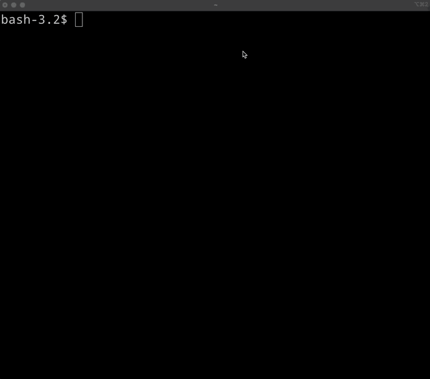
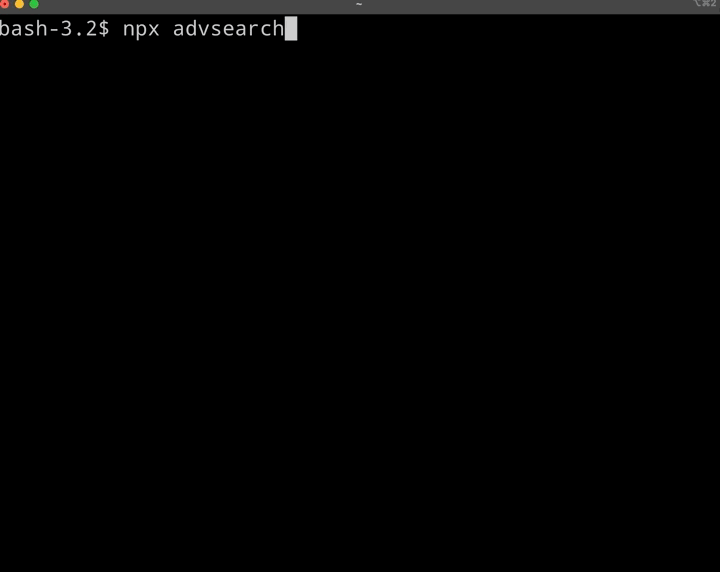

# google-advanced-search

A simple tool to google advanced search setting necessary parameters easily.  
  
You can use this both...  

- as a CLI tool to help you to google more easily and quickly
- as a library to generate a search URL for your projects



## Installation

```bash
npm install google-advanced-search
```

## Usage

```bash
$ npx advsearch -h
Usage: advsearch [options]

Options:
  -c, --configure    configure the default filter settings
  -t, --temporary    set temporary filter (does not apply the default filter settings)
  -n, --not-opening  display results without opening the URL in a browser
  -h, --help         display help for command
```

## Quick Start 1 (to use as a CLI tool)

### Do google search with default filter settings

```bash
npx advsearch
```

### Change and save your filter settings

```bash
npx advsearch -c
```



### Other options

#### Set a temporary filter (without appling it to the default filter settings)

```bash
npx advsearch -t
```

#### Display results without opening the URL in a browser

```bash
npx advsearch -n
```

## Quick Start 2 (to use as a library)

Example (example.js)

```javascript
import { Filter, QueryFieldGroup, UrlBuilder } from './index.js'

const query = new QueryFieldGroup({ queryWords: 'what is bullet train', except: 'movie' })
const filter = new Filter({
  language: 'English',
  region: 'any',
  lastUpdate: 'pastYear',
  siteOrDomain: 'wikipedia.org',
  termsAppearing:'anywhereInThePage'
  safeSearch: 'showExplicitResults',
  fileType: 'any',
  usageRights: 'any'
})

const urlBuilder = new UrlBuilder()

console.log(urlBuilder.generateGoogleSearchUrl(query, filter))

```

You will got:

```url
https://www.google.com/search?as_q=what+is+bullet+train&as_epq=&as_oq=&as_eq=movie&as_nlo=&as_nhi=&lr=lang_en&cr=&as_qdr=y&as_sitesearch=wikipedia.org&as_occt=any&safe=images&as_filetype=&tbs=
```

## Parameters

You can set these parameters below.
When you do not specify them, the default values are set.

### For Search Key Words

They are properties of QueryFieldGroup.

|Name|Description|
|----|----------|
|queryWords|Find pages with all these words.|
|exactWords|Find pages with this exact word or phrase.|
|anyOfTheseWords|Find pages with ny of these words.|
|except|Find pages with none of these words.|
|numbersRangingFrom|Find pages within the range.|
|numbersRangingTo|Find pages within the range.|

### For Result Filter

Language codes and region codes were taken from the following site:  
[XML API reference appendices  |  Programmable Search Engine  |  Google Developers](https://developers.google.com/custom-search/docs/xml_results_appendices)

#### Language

|key|
|---|
|any (default)|
|Arabic|
|Bulgarian|
|Catalan|
|Chinese_Simplified|
|Chinese_Traditional|
|Croatian|
|Czech|
|Danish|
|Dutch|
|English|
|Estonian|
|Finnish|
|French|
|German|
|Greek|
|Hebrew|
|Hungarian|
|Icelandic|
|Indonesian|
|Italian|
|Japanese|
|Korean|
|Latvian|
|Lithuanian|
|Norwegian|
|Polish|
|Portuguese|
|Romanian|
|Russian|
|Serbian|
|Slovak|
|Slovenian|
|Spanish|
|Swedish|
|Turkish|

#### Region

|key|
|---|
|any (default)|
|Afghanistan|
|Albania|
|Algeria|
|American_Samoa|
|Andorra|
|Angola|
|Anguilla|
|Antarctica|
|Antigua_and_Barbuda|
|Argentina|
|Armenia|
|Aruba|
|Australia|
|Austria|
|Azerbaijan|
|Bahamas|
|Bahrain|
|Bangladesh|
|Barbados|
|Belarus|
|Belgium|
|Belize|
|Benin|
|Bermuda|
|Bhutan|
|Bolivia|
|Bosnia_and_Herzegovina|
|Botswana|
|Bouvet_Island|
|Brazil|
|British_Indian_Ocean_Territory|
|Brunei_Darussalam|
|Bulgaria|
|Burkina_Faso|
|Burundi|
|Cambodia|
|Cameroon|
|Canada|
|Cape_Verde|
|Cayman_Islands|
|Central_African_Republic|
|Chad|
|Chile|
|China|
|Christmas_Island|
|Cocos_Keeling_Islands|
|Colombia|
|Comoros|
|Congo|
|Congo_the_Democratic_Republic_of_the|
|Cook_Islands|
|Costa_Rica|
|Cote_Divoire|
|Croatia_Hrvatska|
|Cuba|
|Cyprus|
|Czech_Republic|
|Denmark|
|Djibouti|
|Dominica|
|Dominican_Republic|
|East_Timor|
|Ecuador|
|Egypt|
|El_Salvador|
|Equatorial_Guinea|
|Eritrea|
|Estonia|
|Ethiopia|
|European_Union|
|Falkland_Islands_Malvinas|
|Faroe_Islands|
|Fiji|
|Finland|
|France|
|France_Metropolitan|
|French_Guiana|
|French_Polynesia|
|French_Southern_Territories|
|Gabon|
|Gambia|
|Georgia|
|Germany|
|Ghana|
|Gibraltar|
|Greece|
|Greenland|
|Grenada|
|Guadeloupe|
|Guam|
|Guatemala|
|Guinea|
|Guinea_Bissau|
|Guyana|
|Haiti|
|Heard_Island_and_Mcdonald_Islands|
|Holy_See_Vatican_City_State|
|Honduras|
|Hong_Kong|
|Hungary|
|Iceland|
|India|
|Indonesia|
|Iran_Islamic_Republic_of|
|Iraq|
|Ireland|
|Israel|
|Italy|
|Jamaica|
|Japan|
|Jordan|
|Kazakhstan|
|Kenya|
|Kiribati|
|Korea_Democratic_Peoples_Republic_of|
|Korea_Republic_of|
|Kuwait|
|Kyrgyzstan|
|Lao_Peoples_Democratic_Republic|
|Latvia|
|Lebanon|
|Lesotho|
|Liberia|
|Libyan_Arab_Jamahiriya|
|Liechtenstein|
|Lithuania|
|Luxembourg|
|Macao|
|Macedonia_the_Former_Yugosalv_Republic_of|
|Madagascar|
|Malawi|
|Malaysia|
|Maldives|
|Mali|
|Malta|
|Marshall_Islands|
|Martinique|
|Mauritania|
|Mauritius|
|Mayotte|
|Mexico|
|Micronesia_Federated_States_of|
|Moldova_Republic_of|
|Monaco|
|Mongolia|
|Montserrat|
|Morocco|
|Mozambique|
|Myanmar|
|Namibia|
|Nauru|
|Nepal|
|Netherlands|
|Netherlands_Antilles|
|New_Caledonia|
|New_Zealand|
|Nicaragua|
|Niger|
|Nigeria|
|Niue|
|Norfolk_Island|
|Northern_Mariana_Islands|
|Norway|
|Oman|
|Pakistan|
|Palau|
|Palestinian_Territory|
|Panama|
|Papua_New_Guinea|
|Paraguay|
|Peru|
|Philippines|
|Pitcairn|
|Poland|
|Portugal|
|Puerto_Rico|
|Qatar|
|Reunion|
|Romania|
|Russian_Federation|
|Rwanda|
|Saint_Helena|
|Saint_Kitts_and_Nevis|
|Saint_Lucia|
|Saint_Pierre_and_Miquelon|
|Saint_Vincent_and_the_Grenadines|
|Samoa|
|San_Marino|
|Sao_Tome_and_Principe|
|Saudi_Arabia|
|Senegal|
|Serbia_and_Montenegro|
|Seychelles|
|Sierra_Leone|
|Singapore|
|Slovakia|
|Slovenia|
|Solomon_Islands|
|Somalia|
|South_Africa|
|South_Georgia_and_the_South_Sandwich_Islands|
|Spain|
|Sri_Lanka|
|Sudan|
|Suriname|
|Svalbard_and_Jan_Mayen|
|Swaziland|
|Sweden|
|Switzerland|
|Syrian_Arab_Republic|
|Taiwan_Province_of_China|
|Tajikistan|
|Tanzania_United_Republic_of|
|Thailand|
|Togo|
|Tokelau|
|Tonga|
|Trinidad_and_Tobago|
|Tunisia|
|Turkey|
|Turkmenistan|
|Turks_and_Caicos_Islands|
|Tuvalu|
|Uganda|
|Ukraine|
|United_Arab_Emirates|
|United_Kingdom|
|United_States|
|United_States_Minor_Outlying_Islands|
|Uruguay|
|Uzbekistan|
|Vanuatu|
|Venezuela|
|Vietnam|
|Virgin_Islands_British|
|Virgin_Islands_US|
|Wallis_and_Futuna|
|Western_Sahara|
|Yemen|
|Yugoslavia|
|Zambia|
|Zimbabwe|

#### Last update

|key|
|---|
|anytime (default)|
|past24Hours|
|pastWeek|
|pastMonth|
|pastYear|

#### Safe search

|key|
|---|
|showExplicitResults (default)|
|hideExplicitResults|

#### Terms appearing

|key|
|---|
|anywhereInThePage (default)|
|inTheTitleOfThePage|
|inTheTextOfThePage|
|inTheUrlOfThePage|
|inLinksToThePage|

#### File type

|key|
|---|
|any
|pdf|
|ps|
|dwf|
|kml|
|kmz|
|xls|
|ppt|
|doc|
|rtf|
|swf|

#### Usage rights

|key|
|---|
|freeToUseOrShare|
|freeToUseOrShareCommercially|
|freeToUseShareOrModify|
|freeToUseShareOrModifyCommercially|
